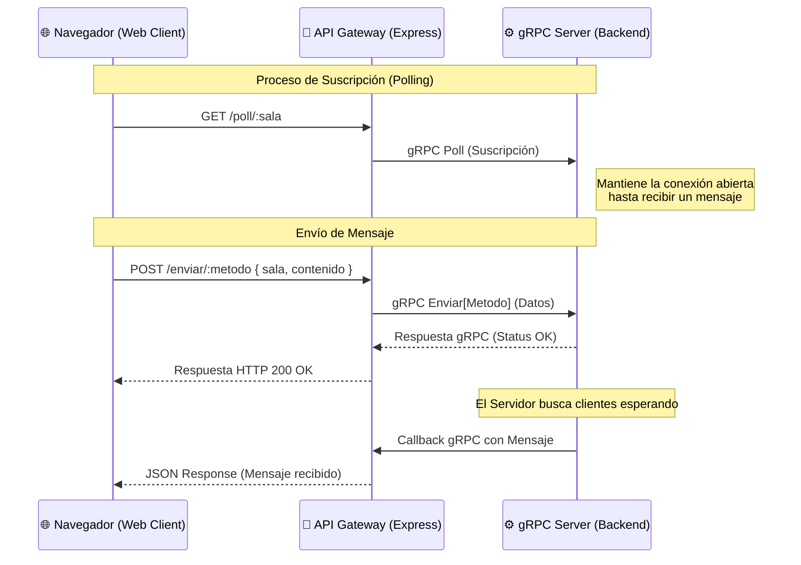

# 💬 Chat System via gRPC & API Gateway

Una implementación robusta de un sistema de mensajería en tiempo real utilizando **gRPC** como protocolo de comunicación principal en el backend y un **API Gateway (Express)** para permitir la interacción con navegadores modernos mediante **HTTP/JSON**.

---

## 🚀 Tecnologías Utilizadas

El proyecto emplea un stack moderno enfocado en alto rendimiento y comunicación eficiente:

*   **[Node.js](https://nodejs.org/):** Entorno de ejecución para el servidor y el gateway.
*   **[gRPC](https://grpc.io/):** Framework RPC de alto rendimiento para la comunicación entre el Backend y el Gateway.
*   **[Protocol Buffers (Proto3)](https://developers.google.com/protocol-buffers):** Lenguaje de serialización para definir los servicios y mensajes.
*   **[Express.js](https://expressjs.com/):** Framework web utilizado para construir el API Gateway.
*   **[HTML5 / CSS3 / JavaScript (Vanilla)](https://developer.mozilla.org/es/):** Interfaz de usuario dinámica y responsiva para el cliente web.

---

## 🛠️ Requisitos e Instalación

### 1. Instalar Node.js
Para ejecutar este proyecto, necesitas tener instalado **Node.js (versión 16 o superior)**.

*   **Descarga Oficial:** [https://nodejs.org/es/download/](https://nodejs.org/es/download/)
*   **Verificar instalación:**
    ```bash
    node -v
    npm -v
    ```

### 2. Clonar e Instalar Dependencias
Una vez tengas Node.js, sigue estos pasos:

```bash
# Clonar el repositorio (o descargar los archivos)
git clone https://github.com/nestortlachi22-cmyk/Chat-implementadado-via-gRPC
cd Chat-implementadado-via-gRPC

# Instalar las dependencias de Node.js
npm install
```

---

## 📡 Arquitectura y Flujo de Datos

El sistema utiliza un patrón de **API Gateway** para puentear la comunicación entre el protocolo HTTP (Navegador) y gRPC (Servidor de Mensajería).

### Diagrama de Flujo



---

## 🏃 Cómo Correr el Proyecto

Para que el chat funcione correctamente, debes iniciar tanto el servidor backend como el gateway en terminales separadas:

### Paso 1: Iniciar el Servidor gRPC (Backend)
Este servidor gestiona la lógica de mensajería, las colas de espera y el enrutamiento de paquetes.
```bash
node server.js
```

### Paso 2: Iniciar el API Gateway
Este puente permite que los navegadores web se comuniquen con el servidor gRPC.
```bash
node gateway.js
```

### Paso 3: Abrir la aplicación
Abre tu navegador y navega a la siguiente dirección:
👉 [http://localhost:3000](http://localhost:3000)

---

## 📨 Patrones de Mensajería Soportados

El sistema implementa cuatro tipos fundamentales de distribución de mensajes definidos en el archivo `mensajeria.proto`:

1.  **Broadcast (Difusión):** El mensaje llega a **todos** los usuarios conectados globalmente.
2.  **Multicast:** El mensaje llega a todos los usuarios suscritos a una **sala específica**.
3.  **Anycast:** El mensaje llega al **primer usuario disponible** en una sala específica (útil para balanceo de carga o atención de tickets).
4.  **Unicast:** Simulado mediante salas privadas con el nombre de usuario, permitiendo chats **uno a uno**.

---

## 📂 Estructura de Archivos Principal

*   `server.js`: Servidor gRPC central que mantiene el estado de los clientes conectados.
*   `gateway.js`: Servidor Express que traduce peticiones HTTP a llamadas gRPC.
*   `mensajeria.proto`: Definición del contrato de servicio y tipos de datos.
*   `public/`: Contiene el frontend (HTML/CSS/JS) para interactuar con el chat.
*   `cliente.js`: Cliente gRPC de prueba para ejecutar en terminal.

---


