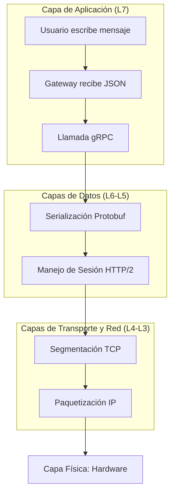

# Capas de Red en el Proyecto RPC Chat (Modelo OSI)

Este documento describe cómo se distribuye la funcionalidad de nuestro sistema de mensajería a través de las diversas capas del modelo OSI, desde la interfaz de usuario hasta la transmisión física de datos.

---

## 1. El Modelo OSI en el Proyecto

A diferencia de un chat tradicional basado en Sockets puros, este proyecto utiliza **gRPC** y un **API Gateway**, lo que abstrae muchas de las tareas de las capas inferiores. Sin embargo, cada capa sigue siendo fundamental :

| Capa OSI | Nombre | Tecnologías Utilizadas | Función en el Proyecto |
| :--- | :--- | :--- | :--- |
| **Capa 7** | **Aplicación** | gRPC, HTTP/1.1, JSON | Interfaz de chat, lógica de envío de mensajes y API Gateway. |
| **Capa 6** | **Presentación** | Protocol Buffers (Protobuf) | Serialización de datos (conversión de objetos JS a binario eficiente). |
| **Capa 5** | **Sesión** | gRPC Channels / HTTP Streams | Mantiene la conexión abierta entre el Gateway y el Servidor gRPC. |
| **Capa 4** | **Transporte** | TCP (Transmission Control Protocol) | Garantiza que los mensajes lleguen completos y en orden. |
| **Capa 3** | **Red** | IPv4 / IPv6 | Direccionamiento IP para que el Gateway encuentre al Servidor (localhost o IP de red). |
| **Capa 2** | **Enlace de Datos** | Ethernet / Wi-Fi | Control de acceso al medio físico y direccionamiento MAC. |
| **Capa 1** | **Física** | Cables, Ondas de Radio | Pulsos eléctricos o luz que transportan los bits. |

---

## 2. Detalle por Capa

### Capa 7: Aplicación (Lógica de Negocio)
Es la capa con la que interactuamos directamente. 
- En el **Frontend**, usamos HTTP/1.1 para enviar mensajes al Gateway.
- En el **Backend**, gRPC define los métodos como `EnviarBroadcast` o `Pollmensajes`.
- Aquí es donde decidimos si un mensaje es **Unicast**, **Multicast**, **Broadcast** o **Anycast** mediante lógica de filtrado en JavaScript.

### Capa 6: Presentación (Traducción y Formato)
En los sockets tradicionales, tú mismo debes convertir el texto a bytes. En este proyecto:
- **Protocol Buffers** se encarga de esto. Convierte el archivo `.proto` en un formato binario altamente comprimido que es mucho más rápido de procesar que el texto plano (JSON).

### Capa 5: Sesión (Control de Diálogo)
Maneja la continuidad de la comunicación:
- gRPC utiliza el concepto de **canales** y **metadatos** para autenticar y mantener flujos de datos constantes (streams) sin que el programador tenga que gestionar reconexiones manuales constantemente.

### Capa 4: Transporte (Confiabilidad)
Aunque implementamos conceptos como "Broadcast" (que en redes puras suele ser UDP), nuestro sistema corre sobre **TCP**:
- **¿Por qué TCP?** gRPC requiere HTTP/2, y HTTP/2 requiere TCP. Esto asegura que si envías un mensaje largo, no llegue "cortado" o desordenado, algo crítico en una aplicación de chat.

### Capa 3: Red (Ruteo)
Aquí es donde entran en juego las direcciones IP:
- El Gateway se conecta al servidor en `0.0.0.0:50051`. El protocolo IP se encarga de saltar de un nodo a otro hasta encontrar el host correcto, incluso si el servidor estuviera en otra computadora de la red local.

---

## 3. Flujo Visual de un Mensaje

---

> [!IMPORTANT]
> **Diferencia entre Capa Física y Lógica:**
> Aunque a nivel **lógico** (Capa 7) hacemos "Broadcast" (enviar a todos), a nivel de **red** (Capa 3) seguimos usando conexiones punto a punto (Unicast) a través de TCP para cada cliente individual. El servidor "simula" el broadcast enviando una copia del mensaje por cada conexión TCP activa.
