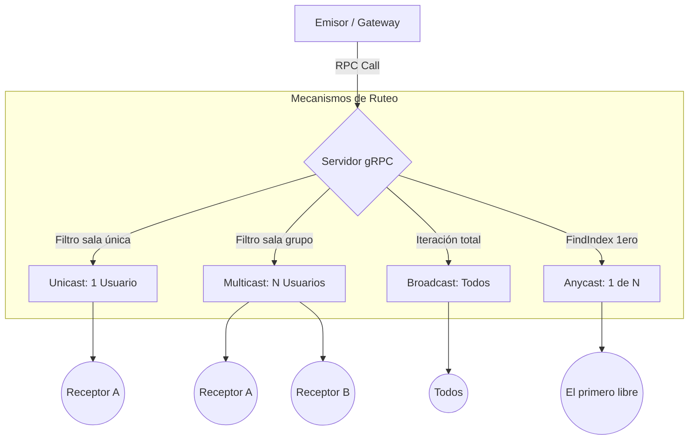

# Guía de Comunicación de Red: Unicast, Multicast, Broadcast y Anycast

Este documento explica los fundamentos de los cuatro modelos de comunicación implementados en este proyecto de Chat RPC y cómo se aplican en el código fuente.

---

## 1. Conceptos Fundamentales

En redes de computadoras, el destino de un paquete de datos define el tipo de comunicación:

| Tipo | Descripción | Analogía |
| :--- | :--- | :--- |
| **Unicast** | Comunicación uno a uno. El mensaje tiene un único destinatario. | Una llamada telefónica privada. |
| **Multicast** | Comunicación uno a muchos. El mensaje llega a un grupo específico de interesados. | Un grupo de WhatsApp o una señal de TV por suscripción. |
| **Broadcast** | Comunicación uno a todos. El mensaje llega a absolutamente todos los nodos de la red. | Una antena de radio pública o un mensaje de emergencia nacional. |
| **Anycast** | Comunicación de uno al "más cercano" o al primero disponible de un grupo. | Llamar al 911: no te contestan todos los operadores, solo el primero que esté libre. |

---

## 2. Implementación en el Proyecto (gRPC)

Nuestra arquitectura utiliza **Google RPC (gRPC)** sobre **TCP/HTTP2** para gestionar estas comunicaciones en la capa de aplicación. El servidor (`server.js`) mantiene una lista en memoria de clientes conectados denominada `clientesEsperando`.

### A. Unicast (Mensajería Privada)
En nuestro sistema, Unicast se logra mediante "Salas" con el nombre del usuario. Cuando el Usuario A envía un mensaje al Usuario B, el mensaje viaja con `sala: "UsuarioB"`.
*   **Lógica:** Se filtra la lista para encontrar al cliente cuya propiedad `sala` coincida exactamente con el nombre del destinatario.

### B. Multicast (Salas de Grupo)
El Multicast permite enviar mensajes a múltiples clientes que están "suscritos" a un identificador de sala (ej. `Sistemas`, `General`).
*   **Lógica en `server.js`:**
    ```javascript
    const enviarMulticast = (mensaje) => {
        const destinatarios = clientesEsperando.filter(c => c.sala === mensaje.sala);
        destinatarios.forEach(cliente => cliente.callback(mensaje));
        clientesEsperando = clientesEsperando.filter(c => c.sala !== mensaje.sala);
    };
    ```

### C. Broadcast (Difusión Global)
El Broadcast en este proyecto se utiliza para anuncios del sistema o cuando se requiere que todos los usuarios actualicen su estado (como descubrir nuevas salas).
*   **Lógica en `server.js`:**
    ```javascript
    const enviarBroadcast = (mensaje) => {
        clientesEsperando.forEach(cliente => cliente.callback(mensaje));
        clientesEsperando = []; // Se despachan todos
    };
    ```

### D. Anycast (Balanceo de Cargas/Tickets)
Anycast se implementó para casos donde una tarea solo debe ser procesada por **un solo integrante** de un grupo, sin importar cuál, siempre que sea el primero disponible.
*   **Lógica en `server.js`:**
    ```javascript
    const enviarAnycast = (mensaje) => {
        const indice = clientesEsperando.findIndex(c => c.sala === mensaje.sala);
        if (indice !== -1) {
            const cliente = clientesEsperando[indice];
            cliente.callback(mensaje); // Solo al primero
            clientesEsperando.splice(indice, 1); // Se elimina solo a ese
        }
    };
    ```

---

## 3. Flujo de Datos

A continuación se muestra cómo viaja un mensaje desde el emisor hasta los receptores según el tipo elegido:



---

## 4. Comparativa Técnica en el Código

| Característica | Broadcast | Multicast | Anycast |
| :--- | :--- | :--- | :--- |
| **Método JS** | `forEach` | `filter` | `findIndex` |
| **Alcance** | Global (Todos) | Selectivo (Grupo) | Único (Primero) |
| **Uso en el Chat** | Alertas globales | Salas de chat | Asignación de tareas |
| **Estado de Cola** | Se vacía entera | Se vacía la sala | Se elimina 1 elemento |

---

> [!TIP]
> **Nota sobre el Long Polling:** Debido a que usamos un modelo de "Suscripción gRPC", cada vez que el servidor despacha un mensaje (`cliente.callback(mensaje)`), la conexión de ese cliente se cierra para entregar el dato. Por eso, los clientes deben realizar una nueva petición `Poll` inmediatamente para seguir "escuchando", manteniendo así el canal virtual activo.
