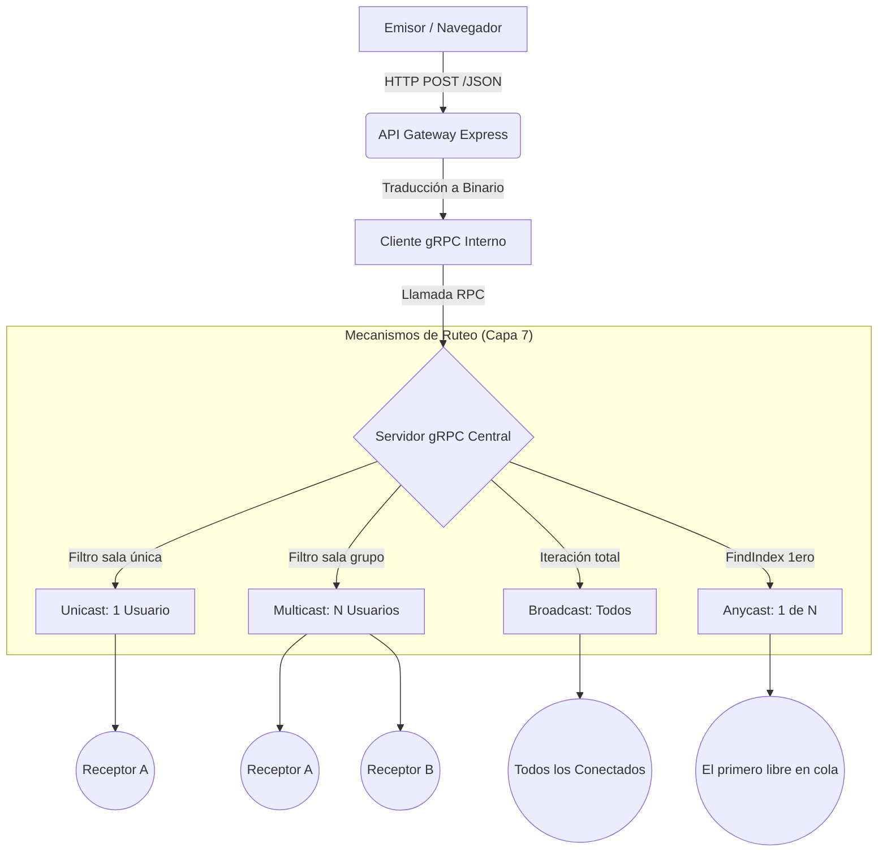

# 📘 Explicación Técnica Exhaustiva: Arquitectura de Chat gRPC

Este documento representa la documentación técnica definitiva del sistema de mensajería. Detalla la ingeniería de software, los protocolos de red y los flujos de datos que permiten una comunicación eficiente y escalable entre múltiples nodos.

---

## 1. El Paradigma RPC vs. Sockets Tradicionales

En el desarrollo de sistemas distribuidos, la elección del protocolo de comunicación define la estabilidad del sistema.

### Limitaciones de los Sockets Nativos:
*   **Gestión de Bytes:** Obligan al programador a manejar buffers crudos, fragmentación de paquetes y terminadores de línea manuales.
*   **Acoplamiento Débil:** No hay un contrato estricto. Si el servidor cambia un campo, el cliente puede romperse sin previo aviso.
*   **Complejidad de Serialización:** Convertir objetos a bytes y viceversa (Marshalling) es un proceso manual propenso a errores.

### La Ventaja de gRPC y el "Contrato" de Software:
Elegimos **gRPC** porque abstrae la complejidad de la red. Para el desarrollador, enviar un mensaje a través del continente es tan sencillo como llamar a una función local: `client.EnviarBroadcast(mensaje)`. Esto se logra mediante un **Contrato de Interfaz** definido en el archivo `mensajeria.proto`.

---

## 2. Inmersión en Protocol Buffers (Protobuf) - Capa 6 OSI

**Protocol Buffers** es el lenguaje de serialización utilizado por gRPC. A diferencia de JSON o XML, que son formatos de texto legibles por humanos, Protobuf es **binario**.

### ¿Por qué Protobuf es superior en este proyecto?
1.  **Eficiencia de Espacio:** Un mensaje JSON de 100 bytes puede reducirse a 20 bytes en Protobuf. Esto es vital para chats con miles de usuarios concurrentes.
2.  **Velocidad de Procesamiento:** El CPU no tiene que "leer" texto; simplemente mapea los campos binarios directamente a la memoria, lo que es hasta 10 veces más rápido que parsear JSON.
3.  **Tipado Estricto:** Si el archivo `.proto` dice que un `id` es un `int32`, el sistema garantiza que nunca se reciba un texto en ese campo, proporcionando una capa de seguridad intrínseca.

### Ejemplo de nuestro Contrato (`mensajeria.proto`):
```protobuf
message Mensaje {
  string tipo = 1;      // Determina si es Bcast, Mcast, etc.
  string sala = 2;      // Destino del mensaje
  string contenido = 3; // Payload del mensaje (JSON stringificado)
}
```
Cada campo tiene un "tag" numérico (1, 2, 3), lo que permite que incluso si cambiamos el nombre del campo en el código, el protocolo siga funcionando mientras el tag se mantenga.

---

## 3. Flujo de Datos Detallado

El ruteo de información sigue un camino preciso desde que el usuario pulsa "Enviar" hasta que el receptor visualiza el texto.

### Diagrama de Flujo de Mensajería


### El Camino de un Mensaje (Paso a Paso):
1.  **Captura (Navegador):** El usuario escribe un mensaje. JavaScript lo empaqueta en un objeto JSON y lo envía mediante un `POST` al Gateway.
2.  **Traducción (Gateway):** El Gateway (Express) recibe el JSON, extrae los datos y realiza una llamada gRPC al Backend. En este punto, **Protobuf convierte el mensaje en binario**.
3.  **Procesamiento (Servidor):** El servidor recibe la trama binaria, la decodifica y revisa su **Estado Global** (la lista `clientesEsperando`).
4.  **Despacho (Ruteo):** Dependiendo del método invocado:
    *   **Broadcast:** El servidor ejecuta un bucle sobre **todos** los punteros de conexión abiertos.
    *   **Multicast:** El servidor filtra a los usuarios que tengan el `sala_id` correcto.
    *   **Anycast:** El servidor selecciona al **primer** usuario en la cola de esa sala y cierra su conexión entregando el dato.
5.  **Recepción (Final):** El receptor, que tenía una conexión de "Larga Espera" (Long Polling), recibe los bits, el Gateway los traduce de vuelta a JSON y el navegador los muestra en pantalla.

---

## 4. Infraestructura y Redes (Capas 3, 4 y 5)

### El Rol de TCP y HTTP/2
Todo este flujo ocurre sobre **TCP**. Elegimos TCP porque el chat es una aplicación "crítica de datos": si un mensaje llega incompleto o desordenado, la conversación pierde sentido. TCP se encarga de:
*   **Retransmisión:** Si un paquete se pierde en el Wi-Fi, se reenvía automáticamente.
*   **Control de Flujo:** Evita que el servidor sature al cliente con demasiados mensajes.

### Conectividad Local y Remota
Gracias a la configuración de red `0.0.0.0` en el Gateway, el sistema es accesible desde cualquier dispositivo en la misma red local (LAN). 
*   **Puerto 3000:** Abierto al mundo para la interfaz gráfica.
*   **Puerto 50051:** Túnel privado gRPC para el backend.

---

## 5. Justificación de los Niveles OSI

*   **Nivel 7 (Aplicación):** Definimos la lógica de "Salas" y "Usuarios" usando **JavaScript**.
*   **Nivel 6 (Presentación):** **Protobuf** asegura que la estructura de los datos sea idéntica en cualquier sistema operativo.
*   **Nivel 5 (Sesión):** **gRPC Channels** gestionan la persistencia de las conexiones, manejando reconexiones automáticas si el servidor se reinicia.
*   **Nivel 4 (Transporte):** **TCP** garantiza una entrega sin errores (Error-free delivery).

---

Este diseño representa una arquitectura de **Sistemas Distribuidos de Grado Industrial**, donde la velocidad de gRPC se combina con la flexibilidad de las interfaces web modernas.
